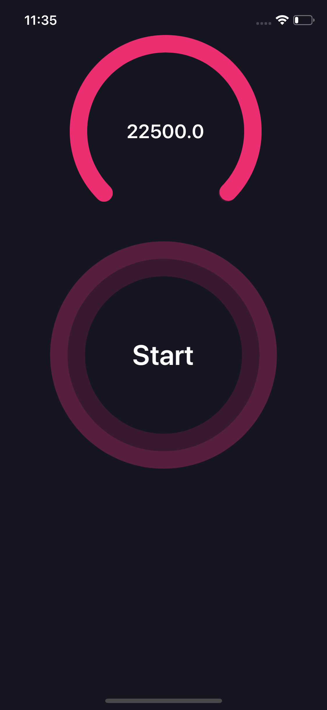

# LineChart
This code is demonstrates a simple lineChart

# Demo
 
 
 
# AnimateCircleCounter
This code is demonstrates a way animating a circle using both a counter, and download progressd

# Demo

# Currency Conversion
This code is demonstrates a way of converting from USD to Ghana Cedis and vice versa

# Demo

# Author

Ewurafua Plange, plangette19@gmail.com

# DropDownwithImages
This code is demonstrates a way of customizing your dropdown menu

# Demo

# Author

Jishnu Raj Tjishnurajt, Ewurafua Plange
